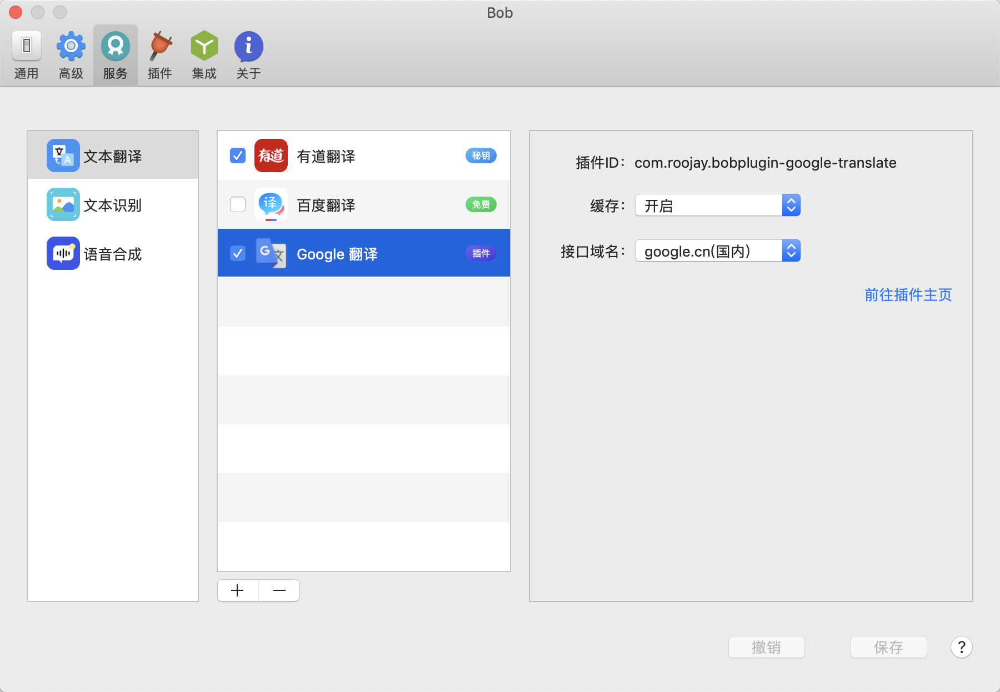
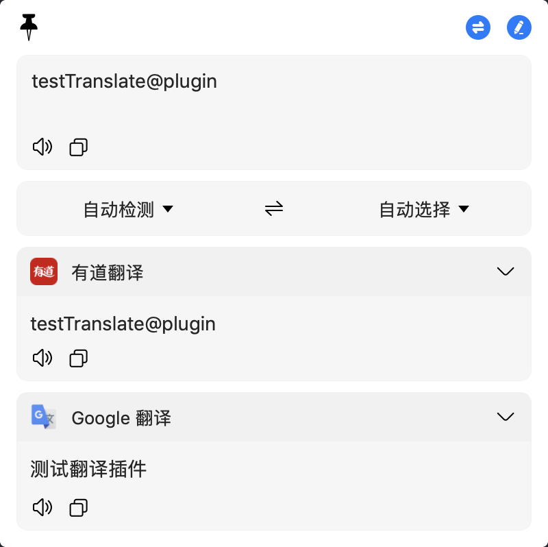

# bobplugin-google-translate

> 这是一个 [Bob](https://bobtranslate.com/) 的 google 翻译插件

## 特性

- 支持缓存查询结果(默认缓存过期时间为一周);
- 支持自定义配置替换 `translate.google.com` 以实现国内直接访问;
- 支持驼峰, 下划线, 部分特殊符号等分隔符;
- 支持 google tts 发音;

## 安装

1. 安装 [Bob](https://ripperhe.gitee.io/bob/#/general/quickstart/install) (version >= 0.50)
2. 下载插件: [bobplugin-google-translate](https://github.com/roojay520/bobplugin-google-translate/releases)
3. 插件安装: [Bob 插件安装文档说明](https://bobtranslate.com/guide/advance/plugin.html#%E4%BD%BF%E7%94%A8%E6%8F%92%E4%BB%B6-1)

## 预览

